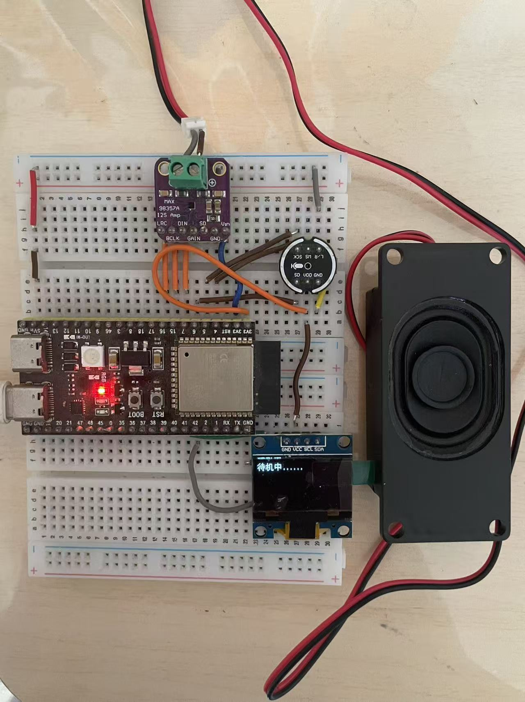
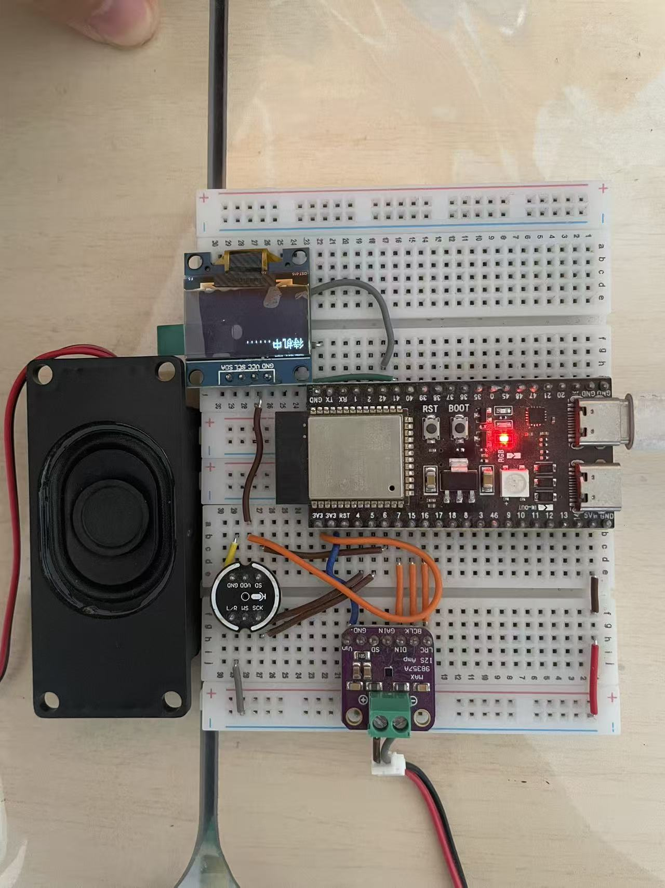

# AI_Robot Voice_Buddy
## 简介
本项目使用ESP32-S3 N16R8接入讯飞星火大模型、豆包大模型（流式调用）、通义千问大模型、ChatGPT大模型实现语音对话聊天功能，支持在线语音唤醒、连续对话、音乐播放等功能，同时外接了一块显示屏实时显示对话的内容。
## 使用说明
### 开通讯飞相关服务（在llm-parameter文件夹可以看到各参数所在位置的图片）
1.进入讯飞开发平台主页（https://www.xfyun.cn），注册账号，然后进入控制台，创建新应用。
2.开通相关服务：
- llm大模型服务：
- stt语音转文字服务：
### 开通豆包大模型服务（可选）
进入火山引擎主页（https://console.volcengine.com），注册账号，实名认证。
主页->产品->豆包大模型（火山方舟）->立即体验->API Key管理->创建API Key->开通管理->开通你想使用的大模型服务->在线推理->创建推理接入点
### 开通通义千问大模型服务（可选）
进入阿里云百炼大模型服务平台（https://bailian.console.aliyun.com），支付宝扫码登录，或者注册账号。
### 项目开发环境
使用vscode中的platformIO插件
### 硬件使用清单
ESP32-S3 N16R8开发板、INMP441全向麦克风、MAX98357 I2S音频放大器模块、喇叭、0.96寸 SSD1306显示屏、面包板、面包板跳线若干、数据线一条、
### 硬件接线
麦克风（INMP441）：
- VDD -> 3.3v
- GND -> GND
- SD -> GPIO6
- WS -> GPIO4
- SCK -> GPIO5

音频放大模块（MAX98357）：
- Vin -> V5IN
- GND -> GND
- DIN -> GPIO7
- BCLK -> GPIO15
- LRC -> GPIO16

0.96寸 SSD1306 OLED屏幕（I2C，地址0x3C，程序会自动扫描0x3C/0x3D）：
- VDD -> 3.3v
- GND -> GND
- SDA -> GPIO41
- SCL -> GPIO42

### 程序执行流程
setup初始化：
- 初始化串口通信、引脚配置、屏幕显示、录音模块Recorder、音频输出模块Audio2。
- 初始化Preferences，调用wifiConnect()连接网络。
- 调用getTimeFromServer()从百度服务器获取当前日期和时间，然后调用getUrl()生成url和url1（分别用于星火大模型和语音识别的鉴权）。
- 如果网络连接成功，则开始对话；如果连接失败，esp32启动热点和web服务器。

loop循环：
- 轮询处理WebSocket客户端消息，检查和处理从服务器接收的消息、发送等待发送的数据，维护与服务器的连接。
- 如果有多段语音需要播放，调用voiceplay()函数播放后续的语音。
- 调用audio2.loop()确保音频流的连续和稳定播放。
- 没有音频播放时，熄灭板载LED；有音频播放时，点亮板载LED。
- 进入待机模式，启动唤醒词识别，可在onMessageCallback1()中自定义唤醒词。
- 检测到板载boot按键被按下时，连接WebSocket服务器1（语音转文字）并开启录音，在10秒内没有说话就会结束本轮对话，然后进入待机模式，启动唤醒词识别。如果有说话，录音结束后调用讯飞STT服务API接口将语音转文本。如果文本内容为空，回复“对不起，我没有听清，可以再说一遍吗？”；不为空时连接WebSocket服务器（大模型），将文本发送给星火大模型（可选豆包大模型），然后接收大模型回复文本，并发送给百度的TTS服务转语音播放，同时在屏幕上显示对话内容。
- 检测到AI说话完毕后，自动连接WebSocket服务器1（语音转文字）并开启录音，后面的与上一条相同，实现连续对话功能。
### 功能介绍
#### 语音唤醒功能
设备启动连接网络后会直接进入待机状态，开启录音并连接讯飞的stt服务进行唤醒词识别，如果长时间不使用，请断开设备电源，防止讯飞stt服务量的大量耗费。唤醒词可在 [src/main/stt.cpp](src/main/stt.cpp) 的 onMessageCallback1() 中修改（搜索「小白」）。
#### 语音对话功能
ESP32连接网络后，进行语音唤醒或者按下板载的boot键即可开始对话。项目使用INMP441全向麦克风模块接受用户的语音输入，然后调用科大讯飞的STT服务API接口，将语音数据发送进行语音识别，接收返回的信息并提取出识别结果。接收到识别结果后，调用科大讯飞的星火大模型（可选豆包大模型）的API接口，将识别结果发送至大模型，由大模型给出回答后，从返回的信息中提取出回答内容，并发送给百度的TTS服务，最终输出语音回答。

- 注意：没有屏幕也能正常进行对话
#### 便捷配网功能
网络连接通过读取ESP32 flash的NVS中存储的Wi-Fi信息实现。设备启动后开始联网时，板载LED会闪烁，屏幕显示相应的连接状态信息。esp32处于断网状态时，ESP32启动AP模式，创建临时网络热点ESP32-Setup（初始密码为12345678）。手机或电脑连接此网络后，浏览器访问（http://192.168.4.1），出现配置网页界面，通过该网页界面，即可进行网络的配置。

配置界面包含以下功能：
- 输入目标Wi-Fi的SSID和密码后，点击Save按钮提交。如果Wi-Fi不存在，则添加到ESP32 flash的NVS中；如果存在，则修改密码。操作完成后，屏幕显示信息。
- 输入目标Wi-Fi的SSID后，按下Delete按钮，从ESP32 flash的NVS中删除Wi-Fi信息。操作完成后，屏幕显示信息。
- 点击List Wi-Fi Networks按钮，查看NVS中已存储的所有Wi-Fi信息。
#### 音乐播放功能
音乐播放白嫖了网易云的音乐服务器，通过（"https://music.163.com/song/media/outer/url?id=音乐数字id.mp3"）即可访问音乐文件（vip音乐不支持）。

音乐播放通过读取ESP32 flash的NVS中存储的音乐信息实现。esp32处于断网状态时，ESP32启动AP模式，创建临时网络热点ESP32-Setup（初始密码为12345678）。手机或电脑连接此网络后，浏览器访问（http://192.168.4.1），出现配置网页界面，通过该网页界面，即可进行音乐信息的添加与删除。

配置界面包含以下功能：
- 输入目标音乐的名称和数字id后，点击Save按钮提交。如果音乐不存在，则添加到ESP32 flash的NVS中；如果存在，则修改数字id。操作完成后，屏幕显示信息。

需要注意的点：比较长的音乐名建议不要写全，因为stt不一定识别的出来，可能只能识别出一部分，然后就是尽量不要写英文名称，因为英文识别准确率太烂了。还有就是部分音乐播放到中间会重新开始播放，好像是网易云的问题。
- 输入目标音乐的名称后，按下Delete按钮，从ESP32 flash的NVS中删除音乐信息。操作完成后，屏幕显示信息。
- 点击List Saved Music按钮，查看NVS中已存储的所有音乐信息。
#### 音量调节功能
通过相关的语音指令，可以实现音量的调节与显示。在AI说话时，按下boot键说出调节音量，esp32做出对应的反应后会继续刚才没说完的话。
#### 音乐暂停和恢复播放指令
在音乐正在播放时，按下boot键说出”暂停播放”指令，即可暂停播放，再按下boot键说出”恢复播放”指令，即可恢复播放。
#### 大模型切换功能指令
在和AI进行对话时，通过说出“切换模型”指令（要具体的说出切换为第几个大模型或者大模型具体的名字），目前可以在豆包，星火，通义千问，ChatGPT四个大模型之间进行切换。
#### 屏幕显示功能
使用一块0.96寸 SSD1306 OLED屏幕（I2C）显示用户与大模型的对话内容等信息
# 项目代码结构
代码已按模块拆分（[src/main/](src/main/)），各文件职责：

| 文件 | 职责 |
|---|---|
| main.cpp | 应用壳：setup/loop、全局状态定义、语音播放调度、打字机同步显示 |
| config.h | **唯一配置点**：硬件引脚、大模型凭据、角色设定、全部时序常量 |
| app.h | 跨模块接口中枢：全局状态 extern 集中声明 |
| display.h/.cpp | OLED 显示：初始化、自动换行、打字机进度显示、音量显示 |
| llm.h/.cpp | 大模型：讯飞星火 WebSocket + 豆包/通义/ChatGPT 统一 HTTP-SSE 流式调用、对话历史 |
| stt.h/.cpp | 讯飞语音识别：录音上传、识别结果处理、全部意图分发（唤醒词/指令/音乐/问答） |
| music.h/.cpp | 音乐指令解析与网易云流播放 |
| commands.h/.cpp | 通用指令：数字提取、音量调节 |
| wifi.h/.cpp | WiFi 连接（遍历 NVS 存储的网络） |
| websetup.h/.cpp | AP 配网 Web 服务器 |
| recorder.h/.cpp | 麦克风录音（INMP441，I2S_NUM_0） |
| mic_i2s.h/.cpp | 麦克风 I2S 驱动封装 |
| Audio2.h/.cpp | 上游 ESP32-audioI2S 裁剪版（仅 MP3 解码），勿改 |

> 所有大模型参数与凭据都在 [src/config.h](src/config.h) 中填写，改代码配置只需改这一个文件。

# 项目部署教程
- 下载vscode和platformIO插件
- 开通讯飞相关服务（可选：开通豆包大模型服务）
- 将项目克隆到本地，在vscode中打开整个文件夹，然后等待依赖库下载完毕（右下角的状态栏显示下载进度）
- 填写 [src/config.h](src/config.h) 中的讯飞账号参数（XF_APPID/XF_API_SECRET/XF_API_KEY；可选：填写豆包/通义/ChatGPT 的模型与 Key）
- 申请百度语音合成access_token（TTS发声必需）：
  1. 注册百度智能云（https://console.bce.baidu.com/），开通"短语音识别-在线合成"服务（个人实名后有免费额度）
  2. 创建应用，获得API Key和Secret Key
  3. 浏览器访问 `https://aip.baidubce.com/oauth/2.0/token?grant_type=client_credentials&client_id=你的APIKey&client_secret=你的SecretKey`，返回的JSON中access_token字段即为所需token
  4. 替换src/main/Audio2.cpp中 `&tok=` 后面的值（约30天过期，失效后需重新获取替换）
- 安装esp32的驱动
- 编译、烧录
## 实机测试清单
改动固件后建议按此回归：
1. 上电：OLED 显示、I2C 地址扫描、WiFi 连接、鉴权 URL（串口日志）
2. 唤醒词「小白」→「我来了，主人。」TTS + 打字机同步显示
3. 默认模型（星火）一轮问答 + 长回答分段播放（>180 字）
4. 长回答无标点场景（讲长故事，不死机）
5. 切模型四连问（豆包/星火/通义/ChatGPT）
6. 连续对话 + 历史记忆（「我刚才说了什么」）
7. 音量六分支（含「音量调到999」→ 应钳制为 100）、开/关灯、暂停/恢复
8. 音乐：听歌名/随便/顺序/上一首/下一首/再听一遍/不想听/最爱
9. 退下→待机；10 秒静音超时；说话停顿约 0.6 秒结束识别
10. boot 键：待机唤醒、录音中按键开始对话、单击只触发一次
11. 播放中发新问题（旧声立停、新回答正常）
12. 断开网络→AP 配网（保存/更新/删除/列表 WiFi+音乐）→ **重启设备**连新网
13. 长回答播放期间声音连续（回答首段到达即出声）
## 项目成品图参考

